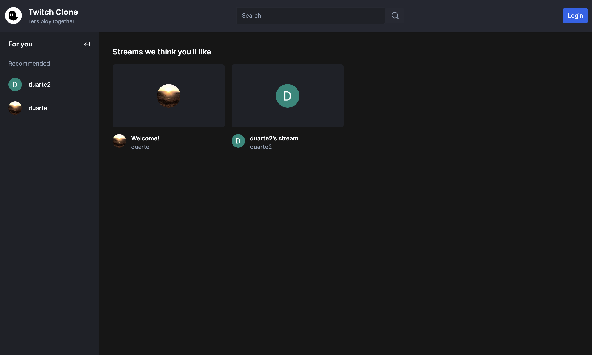
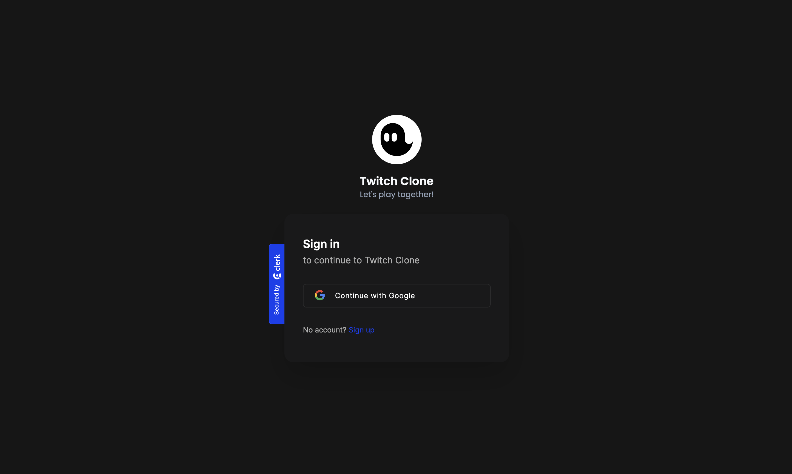
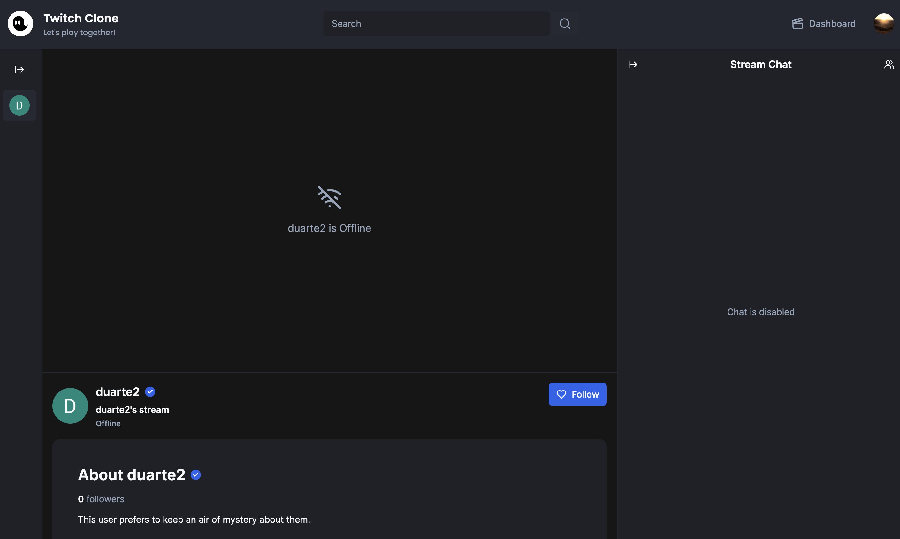
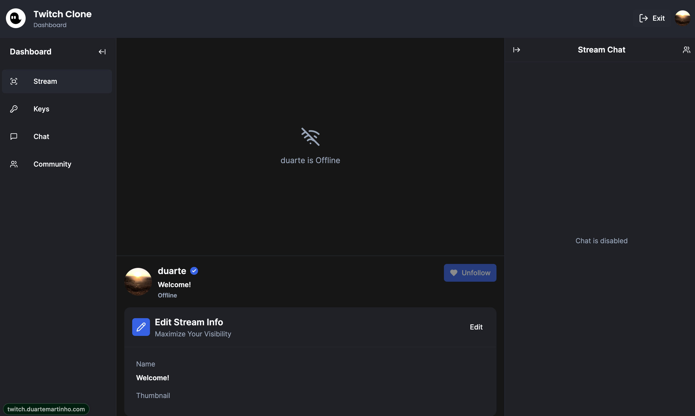
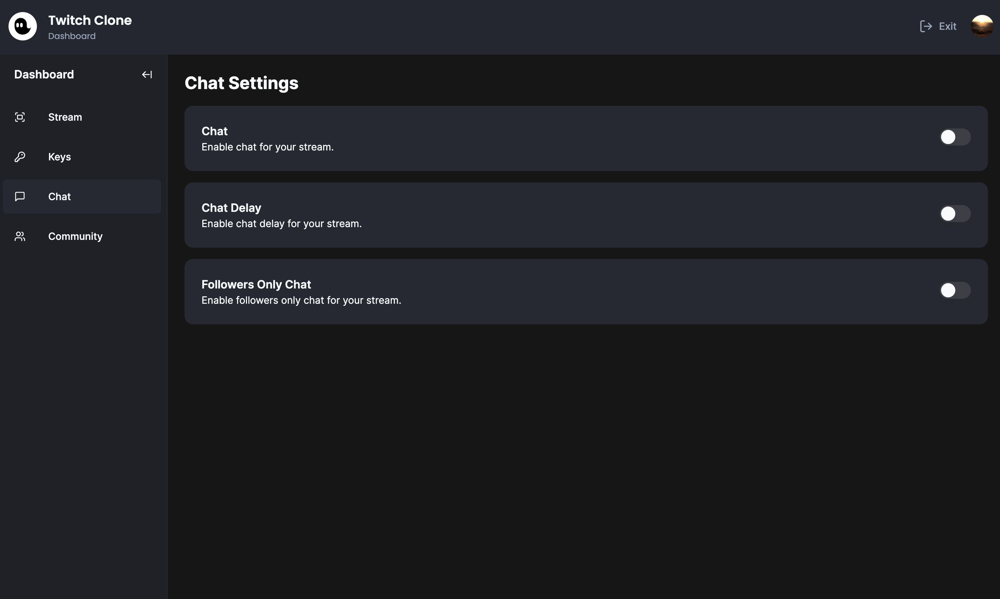
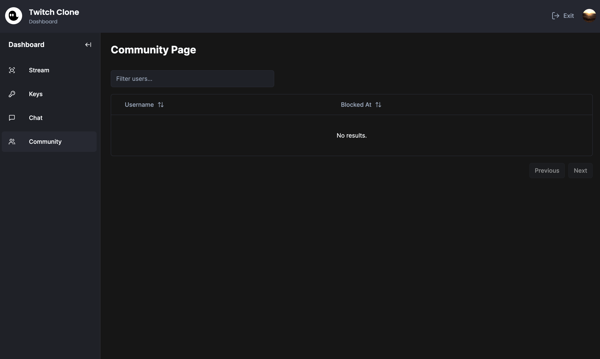

# Twitch Clone

# Features:

- 📡 Streaming using RTMP / WHIP protocols
- 🌐 Generating ingress
- 🔗 Connecting Next.js app to OBS / Your favorite streaming software
- 🔐 Authentication
- 📸 Thumbnail upload
- 👀 Live viewer count
- 🚦 Live statuses
- 💬 Real-time chat using sockets
- 🎨 Unique color for each viewer in chat
- 👥 Following system
- 🚫 Blocking system
- 👢 Kicking participants from a stream in real-time
- 🎛️ Streamer / Creator Dashboard
- 🐢 Slow chat mode
- 🔒 Followers only chat mode
- 📴 Enable / Disable chat
- 🔽 Collapsible layout (hide sidebars, chat etc, theatre mode etc.)
- 📚 Sidebar following & recommendations tab
- 🏠 Home page recommending streams, sorted by live first
- 🔍 Search results page with a different layout
- 🔄 Syncing user information to our DB using Webhooks
- 📡 Syncing live status information to our DB using Webhooks
- 🤝 Community tab
- 🎨 Beautiful design
- ⚡ Blazing fast application
- 📄 SSR (Server-Side Rendering)
- 🗺️ Grouped routes & layouts
- 🗃️ MySQL
- 🚀 Deployment

## Commands

### Prisma

npx prisma db push
npx prisma generate
npx prisma studio
npx prisma migrate reset

## Ngrok

To run ngrok in the terminal, run the following command:

`ngrok http --domain=$DOMAIN 3000`

Make sure to replace the `$DOMAIN` with your domain name.

## Environment Variables

### Definitions

- `NEXT_PUBLIC_CLERK_PUBLISHABLE_KEY` -> Clerk Publishable Key
- `CLERK_SECRET_KEY`-> Clerk Secret Key
- `NEXT_PUBLIC_CLERK_SIGN_IN_URL`-> Clerk Sign In Url e.g /login
- `NEXT_PUBLIC_CLERK_SIGN_UP_URL`-> Clerk Sign Up Url e.g /register
- `NEXT_PUBLIC_CLERK_AFTER_SIGN_IN_URL`-> Clerk After Sign In Url e.g /dashboard
- `NEXT_PUBLIC_CLERK_AFTER_SIGN_UP_URL`-> Clerk After Sign Up Url e.g /dashboard
- `CLERK_WEBHOOK_SECRET` -> Clerk webhook secret
- `DATABASE_URL` -> Database Url
- `LIVEKIT_API_URL` -> Livekit API Url
- `LIVEKIT_API_KEY` -> Livekit API Key
- `LIVEKIT_API_SECRET` -> Livekit API Secret
- `NEXT_PUBLIC_LIVEKIT_WS_URL` -> Livekit WS `Url
- `UPLOADTHING_SECRET` -> Uploadthing Secret
- `UPLOADTHING_APP_ID` -> Uploadthing App Id

### Sample .env file

```
DATABASE_URL=
NEXT_PUBLIC_CLERK_PUBLISHABLE_KEY=
CLERK_SECRET_KEY=
NEXT_PUBLIC_CLERK_SIGN_IN_URL=/login
NEXT_PUBLIC_CLERK_SIGN_UP_URL=/register
NEXT_PUBLIC_CLERK_AFTER_SIGN_IN_URL=/dashboard
NEXT_PUBLIC_CLERK_AFTER_SIGN_UP_URL=/dashboard
CLERK_WEBHOOK_SECRET=
LIVEKIT_API_URL=
LIVEKIT_API_KEY=
LIVEKIT_API_SECRET=
NEXT_PUBLIC_LIVEKIT_WS_URL=
UPLOADTHING_SECRET=
UPLOADTHING_APP_ID=
```

## Screenshots









## How to run

1. Clone the repository
2. Run `npm install`
3. Fill in the environment variables
4. Run `npm run dev`

Note: Completed by following a tutorial
